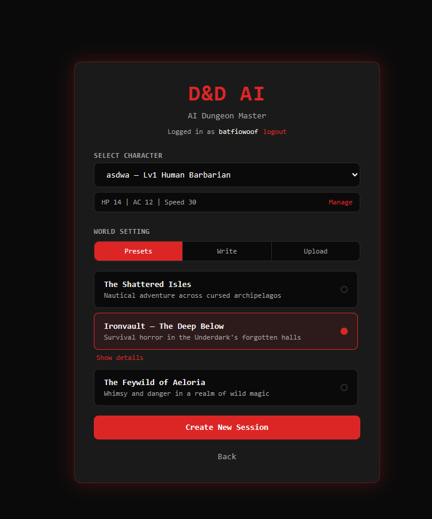
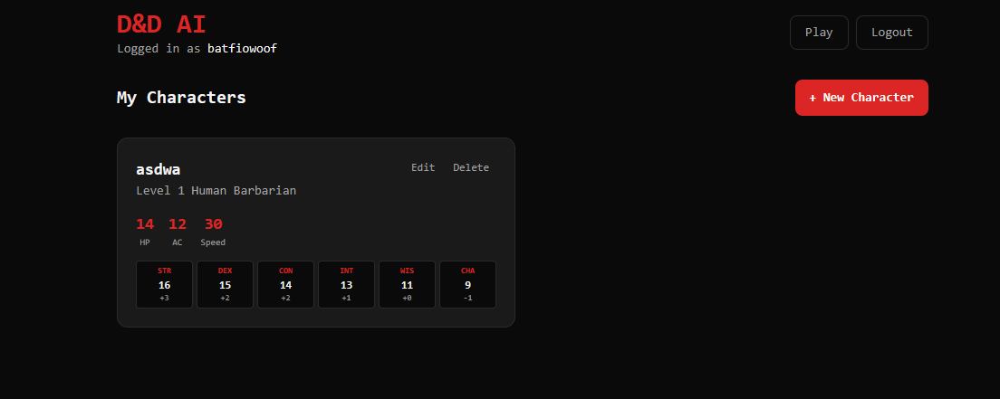
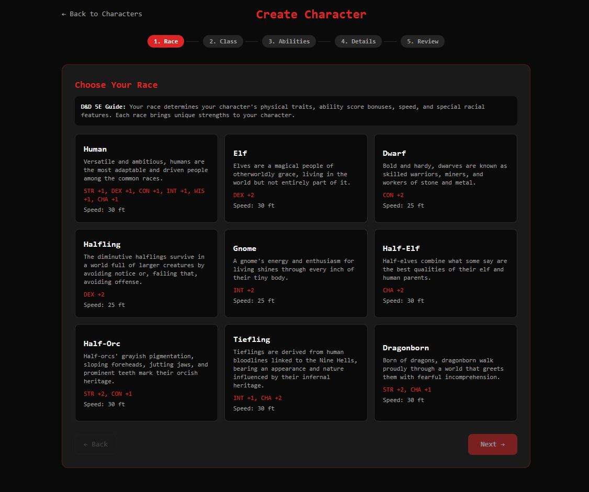

# D&D AI — AI-Powered Dungeon Master

A multiplayer Dungeons & Dragons web application where an AI acts as the Dungeon Master. Players join sessions via invite codes, take turns describing their actions, and receive narrated responses from an LLM-powered DM that maintains world consistency through Retrieval-Augmented Generation (RAG).

## Architecture

```
┌──────────┐  WebSocket/STOMP  ┌──────────────┐  Kafka  ┌─────────┐
│ Next.js  │◄────────────────►│ Spring Boot  │◄──────►│  Kafka  │
│ Frontend │   REST /api/*     │   Backend    │         │ (KRaft) │
└──────────┘                   └──────┬───────┘         └─────────┘
                                      │
                        ┌─────────────┼─────────────┐
                        ▼             ▼             ▼
                  ┌──────────┐ ┌──────────┐ ┌───────────┐
                  │PostgreSQL│ │  Ollama  │ │ Keycloak  │
                  │+ pgvector│ │  (LLM)   │ │  (OAuth2) │
                  └──────────┘ └──────────┘ └───────────┘
```

### Backend — Spring Boot 4 / Java 21

- **REST + WebSocket (STOMP)** for session management and real-time gameplay
- **Spring AI + Ollama** for LLM-based Dungeon Master responses
- **RAG pipeline** using pgvector for semantic search over world documents and session history
- **Kafka (KRaft)** for async event processing — player actions, DM responses, turn advancement, session events
- **Keycloak** for OAuth2/OIDC authentication (dev profile supports mock JWT via `X-User` header)
- **Flyway** for database migrations
- **Resilience4j** circuit breaker on AI calls with graceful fallback

### Frontend — Next.js 15 / React 19

- **TypeScript + Tailwind CSS**
- **STOMP over WebSocket** for real-time game updates
- API proxy to backend via Next.js rewrites

### Data Model

| Table | Purpose |
|---|---|
| `game_sessions` | Session state, turn order (JSONB), join code |
| `players` | Player/character info, role (PLAYER / DM_AI) |
| `turn_events` | Action log with DM responses, ordered by turn |
| `world_documents` | RAG vector store — world lore with 1536-dim embeddings |

### Kafka Topics

| Topic | Description |
|---|---|
| `game.player.action` | Player submits an action |
| `game.dm.response` | AI DM narration result |
| `game.turn.next` | Turn advancement signal |
| `game.session.event` | Join/start/end lifecycle events |

## Prerequisites

- **Docker** and **Docker Compose**
- (For local dev without Docker) Java 21, Node.js 22, Maven

## Quick Start

### Full stack with Docker Compose

```bash
docker compose up --build
```

This starts all services:

| Service | URL |
|---|---|
| Frontend | http://localhost:3000 |
| Backend API | http://localhost:8080 |
| Keycloak Admin | http://localhost:8180 (admin / admin) |
| Ollama | http://localhost:11434 |
| PostgreSQL | localhost:5555 |
| Kafka | localhost:9092 |

After the first start, pull the LLM model:

```bash
docker exec -it dnd-ollama ollama pull llama3.2
```

### Local Development

Start infrastructure only:

```bash
docker compose up postgres kafka keycloak ollama
```

Run the backend with the dev profile (mock auth — no Keycloak setup needed):

```bash
./mvnw spring-boot:run -Dspring-boot.run.profiles=dev
```

Run the frontend:

```bash
cd frontend
npm install
npm run dev
```

The dev profile accepts an `X-User` header as identity:

```bash
curl -H "X-User: aragorn" http://localhost:8080/api/characters
```

For WebSocket STOMP connections, pass the username as the Bearer token:

```
Authorization: Bearer aragorn
```

## API Overview

### REST Endpoints

- `POST /api/characters` — Create or update a character

### WebSocket (STOMP)

Connect to `/ws` with STOMP, then:

| Destination | Direction | Description |
|---|---|---|
| `/app/game/{sessionId}/join` | Send | Join a session |
| `/app/game/{sessionId}/action` | Send | Submit a player action |
| `/user/queue/joined` | Receive | Join confirmation + game state |
| `/user/queue/errors` | Receive | Error messages |
| `/topic/game/{sessionId}` | Receive | Broadcast game state updates |

## Project Structure

```
├── docker-compose.yml
├── Dockerfile                          # Backend Docker image
├── pom.xml                             # Maven — Spring Boot 4
├── src/main/java/com/dungeon/master/
│   ├── config/                         # AI, Kafka, Security, WebSocket config
│   ├── controller/                     # REST controllers
│   ├── websocket/                      # STOMP controllers + auth interceptor
│   ├── service/
│   │   ├── ai/                         # DmAiService, RagService, EmbeddingService
│   │   └── game/                       # GameSession, Turn, Player services
│   ├── kafka/
│   │   ├── producer/                   # GameEventProducer
│   │   └── consumer/                   # Action, DM response, turn, session consumers
│   ├── model/
│   │   ├── entity/                     # JPA entities
│   │   ├── dto/                        # Request/response DTOs
│   │   └── enums/                      # GameStatus, PlayerRole, etc.
│   ├── repository/                     # Spring Data JPA repositories
│   └── exception/                      # Custom exceptions + global handler
├── src/main/resources/
│   ├── db/migration/V1__init.sql       # Flyway migration
│   └── application-dev.yml             # Dev profile config
└── frontend/
    ├── Dockerfile                      # Frontend Docker image
    ├── package.json                    # Next.js 15 + React 19
    └── src/
        ├── app/                        # Next.js pages (lobby, game)
        ├── lib/                        # API client, WebSocket helpers
        └── types/                      # TypeScript types
```

## Tech Stack

| Layer | Technology |
|---|---|
| Frontend | Next.js 15, React 19, TypeScript, Tailwind CSS |
| Backend | Spring Boot 4, Java 21, Spring AI, Spring Security |
| AI / LLM | Ollama (llama3.2), Spring AI ChatClient |
| Vector Search | pgvector (cosine similarity, IVFFlat index) |
| Messaging | Apache Kafka (KRaft mode) |
| Auth | Keycloak (OAuth2 / OIDC) |
| Database | PostgreSQL 16 + pgvector |
| Migrations | Flyway |
| Resilience | Resilience4j (circuit breaker) |
| Build | Maven, npm |
| Containers | Docker, Docker Compose |

## Demo Images




